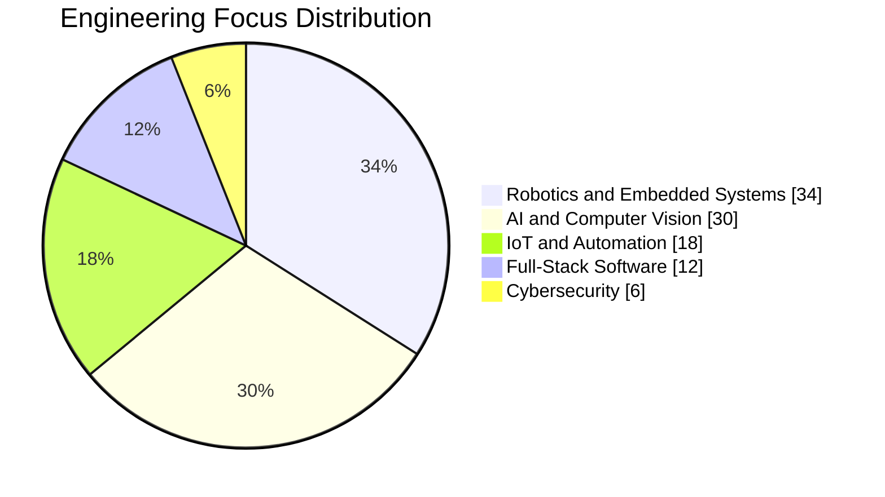

<div align="center">
  
</div>

<h3 align="center">AI and Machine Learning Enthusiast | Robotics and IoT Developer | Embedded Systems Engineer</h3>

<p align="center">
  <a href="https://sakshyambastakoti.com.np" target="_blank">
    
  </a>
  <a href="https://www.linkedin.com/in/sakshyambastakoti/" target="_blank">
    
  </a>
  <a href="mailto:sakshyamxeetri@gmail.com">
    
  </a>
  <a href="https://github.com/sakxam-xeetri" target="_blank">
    
  </a>
</p>

---

## Professional Profile

I design and build intelligent, real-world systems where software, electronics, and automation work together.
My work combines full-stack engineering with embedded development to deliver robotics and IoT solutions that are practical, scalable, and production-oriented.

Core hands-on platforms include ESP32, ESP8266, Arduino, and Raspberry Pi, with implementation experience in computer vision, sensor integration, and edge AI pipelines.

## Career Objective

To grow as a full-stack hardware-software engineer and contribute to impactful innovation in artificial intelligence, robotics, and secure smart technologies.

---

## Technical Skills

<details open>
  <summary><b>Programming and Software Development</b></summary>
  <br>
  
  
  
  
  
  
  
  
  
  
</details>

<details open>
  <summary><b>Robotics, IoT, and Embedded Engineering</b></summary>
  <br>
  
  
  
  
  
  
  
</details>

<details open>
  <summary><b>Artificial Intelligence and Machine Learning</b></summary>
  <br>
  
  
  
  
  
  
  
</details>

<details open>
  <summary><b>Cybersecurity and Security Tooling</b></summary>
  <br>
  
  
  
  
  
  
  
</details>

---

## Skills Focus Chart



## Current Learning Roadmap

```text
Advanced ML Systems
AI-Driven Robotics
Edge AI Deployment
Full-Stack IoT Platforms
Secure Embedded Systems
Ethical Hacking and Red Teaming
```

---

## GitHub Analytics

<p align="center">
  
  
</p>

<p align="center">
  
  
</p>

<p align="center">
  
</p>

<p align="center">
  
</p>

---

<p align="center">
  
</p>
